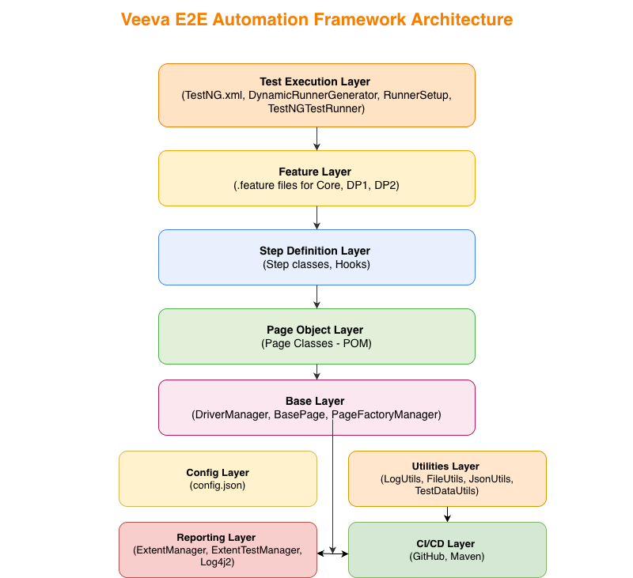
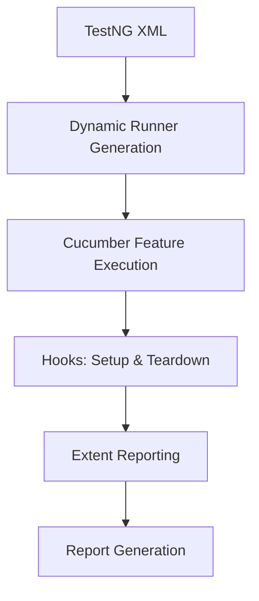

# 🧩 Veeva E2E Automation Framework


[](https://www.oracle.com/java/)
[](https://maven.apache.org/)
[](https://www.selenium.dev/)
[](https://cucumber.io/)
[](https://testng.org/)
[](LICENSE)

---

## Table of Contents
1. [Overview](#overview)
2. [Framework Structure](#framework-structure)
3. [Prerequisites](#prerequisites)
4. [Setup](#setup)
5. [Running Tests](#running-tests)
6. [Configuration](#configuration)
7. [Selectors & Test Data](#selectors--test-data)
8. [Utilities & Helpers](#utilities--helpers)
9. [Reporting](#reporting)
10. [Execution Flow](#execution-flow)
11. [Best Practices](#best-practices)
12. [Troubleshooting](#troubleshooting)
13. [FAQ](#faq)
14. [License](#license)
15. [Contributing](#contributing)

---

## Overview
This **Veeva E2E Automation Framework** enables automated end-to-end UI and functional testing for **Core Product**, **DP1**, and **DP2** modules using:

- **Java 11+**
- **Selenium 4.x**
- **Cucumber (BDD)**
- **TestNG**
- **Extent Reports**
- **JSON-based Test Data**

                             
    ### **The overall architecture of the Veeva Automation Framework**




### 🔑 Key Highlights
- Modular **Page Object Model (POM)**
- Dynamic **Cucumber runner generation**
- **JSON-driven** selectors and expected data
- **Reusable BasePage & BaseTest** setup
- Unified **TestNG + Cucumber execution**
- **Log4j2** logging and detailed reporting

---

## Framework Structure

| Path | Description |
|------|--------------|
| `src/main/java/com/veeva/automation/base` | Base setup (`BasePage`, , `DriverManager`) |
| `src/main/java/com/veeva/automation/pages` | Page Object classes for core, DP1, and DP2 modules |
| `src/main/java/com/veeva/automation/factory` | Page factory and support classes |
| `src/main/java/com/veeva/automation/utils` | Utility classes like `TestDataUtils`, `FileUtils`, etc. |
| `src/main/resources/config/config.json` | Global configuration file |
| `src/main/resources/templates/FeatureRunnerTemplate.java` | Template for dynamic Cucumber runners |
| `src/test/java/com/veeva/automation/steps` | Cucumber step definitions and hooks |
| `src/test/java/com/veeva/automation/runner` | Dynamic & static Cucumber TestNG runners |
| `src/test/java/com/veeva/automation/report` | Extent Report setup and management |
| `src/test/resources/features` | Cucumber feature files grouped by module |
| `src/test/resources/testdata` | JSON test data such as selectors and expected slide info |
| `src/test/resources/js` | Supporting JavaScript utilities for DOM extraction |

---

## Prerequisites
- **Java 11+**
- **Maven 3.9+**
- **Chrome/Firefox browsers**
- **ChromeDriver/GeckoDriver** in PATH
- **IDE:** IntelliJ IDEA or Eclipse recommended

---

## Setup

### 1️⃣ Clone the Repository
```bash
git clone https://github.com/ashishbehera/veeva-e2e-automation-framework.git
cd veeva-e2e-automation-framework
```

### 2️⃣ Install Dependencies
```bash
mvn clean install -DskipTests
```

### 3️⃣ Configure Environment
Update the following in `config.json`:
```properties
browser=chrome
headless=false
baseUrl=https://www.nba.com/warriors
```

---

## Running Tests

### 🧪 From Command Line
```bash
# Run  tests based on tag Smoke
mvn clean test -Dcucumber.filter.tags="@Smoke"

# Run  other tags like regression suite
mvn clean test -Dcucumber.filter.tags="@Regression"

# Run multiple tags
mvn clean test -Dcucumber.filter.tags="@Smoke or @Regression"

# Run specific module and override browser
mvn clean test -Dcucumber.filter.tags="@Smoke" -Dbrowser=firefox

```

### 🧩 From TestNG XML
You can run multiple modules or browsers in parallel using `testng.xml` using "mvn clean test" command

```xml
<suite name="Veeva Automation Suite" parallel="tests">
  <test name="Smoke Suite - Chrome">
    <parameter name="browser" value="chrome"/>
    <classes>
      <class name="com.veeva.automation.runner.CoreRunner"/>
    </classes>
  </test>
</suite>
```
```xml
<suite name="Veeva Automation Suite" parallel="tests" thread-count="2">
  <test name="Smoke Suite - Chrome">
    <parameter name="browser" value="chrome"/>
    <classes>
      <class name="com.veeva.automation.runner.CoreRunner"/>
    </classes>
  </test>

  <test name="Regression Suite - Firefox">
    <parameter name="browser" value="firefox"/>
    <classes>
      <class name="com.veeva.automation.runner.DP1Runner"/>
    </classes>
  </test>
</suite>
```

---

## Configuration

- **Global config:** `src/main/resources/config/config.json`
- **Browser setup:** Controlled by `DriverManager` and `WebDriverFactory`
- **Headless mode:** Toggle via `headless=true/false`

---

## Selectors & Test Data

Selectors and expected data are stored in **JSON files** under:
```
src/test/resources/testdata/
```
Example:
```json
{
  "slideTitle": "#slide-header",
  "duration": ".slide-duration"
}
```

---

## Utilities & Helpers

| Utility | Description |
|----------|-------------|
| `TestDataUtils.java` | Reads and parses JSON test data |
| `LinkUtils.java` | Manages links for the web pages |
| `FileUtils.java` | File operations for reports, logs, etc. |

---

## Reporting

- Integrated **Extent Reports (v5+)**
- Automatic report generation under `test-output/ExtentReports`
- **Log4j2** for detailed logging
- Supports integration with **Allure Reports** (optional)

---

## Execution Flow



---

## Best Practices

✅ Keep locators and test data externalized in JSON.  
✅ Use `BasePage` methods for all WebDriver actions.  
✅ Maintain `config.properties` per environment.  
✅ Integrate with CI/CD (Maven).  
✅ Use tags (`@smoke`, `@regression`, `@dp1`) for modular runs.

---

## Troubleshooting

| Issue | Possible Cause | Resolution |
|--------|----------------|------------|
| `SessionNotCreatedException` | Mismatch between browser and driver versions | Chcek WebDriverManager or manually update to the latest driver that matches your browser version. |
| `ConfigReader` returning null | Missing config.json key | Ensure  key exists |
| JSON Parsing errors | Malformed test data JSON | Validate JSON syntax |

---

## FAQ

### 🔹 1. What is the purpose of the **Dynamic Runner Generator**?
> It dynamically creates individual **Cucumber TestNG runner classes** at runtime for each feature file, enabling **parallel execution** and removing the need for multiple manually created runners.

---

### 🔹 2. What does the **RunnerSetup** class do?
> It initializes the **test environment** before execution — loads configuration, browser, and environment details, sets up reporting folders, and passes parameters to the dynamically generated runners.

---

### 🔹 3. What is a **Cucumber Runner**?
> A **Cucumber Runner** is a TestNG-based class (with `@CucumberOptions`) that triggers execution of feature files using the Cucumber engine. Each runner links features, glue code, and tags.

---

### 🔹 4. What is the role of **TestNG.xml**?
> `testng.xml` is the **execution controller**. It defines test suites, parallel runs, and runtime parameters like browser or environment, providing a single control point for the entire automation run.

---

### 🔹 5. Are **Hooks** similar to **BaseTest**?
> Yes. In BDD frameworks, **Hooks** perform setup and teardown actions just like a BaseTest — initializing the WebDriver, loading config, and cleaning up after each test scenario.

---

### 🔹 6. Why use **Dynamic Runners** instead of static ones?
> Dynamic Runners make the framework **scalable and maintenance-free** — new feature files are picked up automatically without manually adding new runner classes.

---

### 🔹 7. How is **CI/CD** handled in this framework?
> The framework is **CI/CD-ready** and integrates via **Maven**, allowing execution from command line and future integration with Jenkins or GitHub Actions.

---

### 🔹 8. What reporting is implemented?
> **Extent Reports (v5)** is integrated for visual HTML reporting with scenario-level logs and screenshots. It’s initialized via Hooks at runtime.

---

### 🔹 9. How is test data managed?
> All selectors and test data are externalized in **JSON files**, accessed dynamically through utility classes for better maintainability and flexibility.

---

### 🔹 10. How does parallel execution work?
> Parallel execution is managed by **TestNG** and **Dynamic Runner Generator**, where each generated runner runs in a separate thread/browser instance.

---

### 🔹 11. How does the framework handle environment configuration?
> It reads configuration from `config.json`, allowing easy switching between QA, UAT, and Prod without code changes.

---

### 🔹 12. What design patterns are used?
> The framework follows **Page Object Model (POM)**, **Factory**, and **Singleton** patterns for better scalability, maintainability, and reusability.

---

### 🔹 13. How are logs managed?
> Logging is handled using **Log4j2**, which captures browser actions, validations, and exceptions for debugging.

---

### 🔹 14. Can this framework be extended to API or Mobile automation?
> Yes. The modular structure allows easy integration with **Rest Assured** or **Appium** modules under the same execution model.


---

## License
This framework is released under the [MIT License](LICENSE).

---

## Contributing
Contributions are welcome!  
1. Fork this repository  
2. Create a feature branch  
3. Commit your changes  
4. Submit a Pull Request 🚀

---

© 2025 Veeva Systems - E2E Automation Framework
